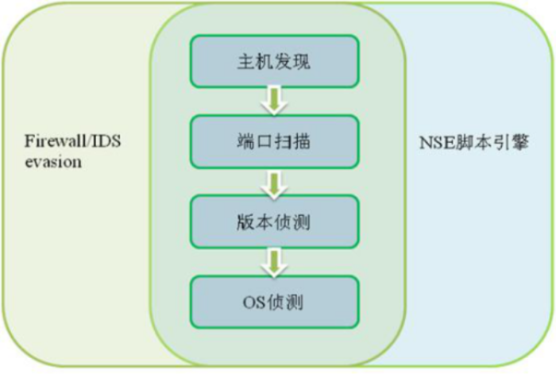
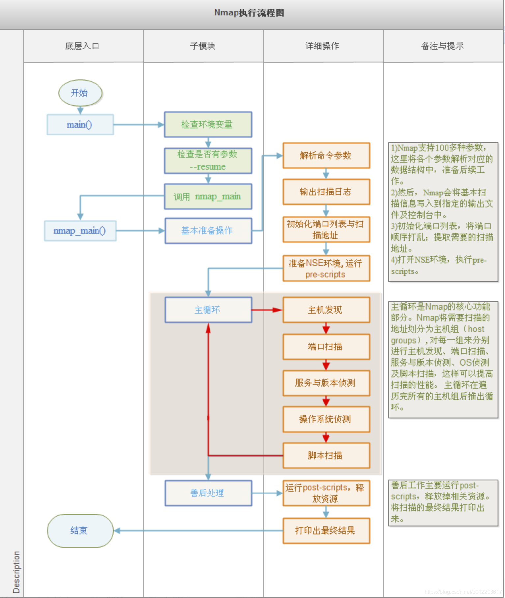

# Nmap运行流程

Nmap的运行过程可见官方文档：[https://nmap.org/book/nmap-phases.html](https://nmap.org/book/nmap-phases.html)

Nmap的运行流程可以描述为：

* 输入
* 主机发现
* 端口扫描
* 版本探测
* 操作系统探测
* 输出

 一个完整的扫描流程是：预扫描脚本加载、目标列举、主机发现、DNS反向解析、端口扫描、服务与版本探测、操作系统探测、网络路由监测、脚本扫描、结果输出和后扫描脚本加载。

